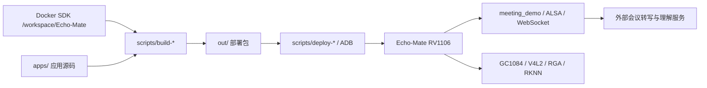

# Echo-Mate RV1106 开发工作区

Echo-Mate RV1106 Linux 开发板 / 桌面机器人应用工作区，包含会议纪要助手、GC1084 摄像头与 YOLOv5 推理应用、Docker 交叉编译入口、ADB 部署工具和板级验证记录。

应用基线为 **Buildroot + Linux 5.10 + LVGL 9.2 + framebuffer**。本仓库保存自有应用和集成脚本；完整上游 SDK、模型、固件和本机运行配置单独管理。

## 功能与入口

| 模块 | 实现与职责 | 构建入口 |
| --- | --- | --- |
| 会议纪要 | [meeting-demo](apps/meeting-demo/README.md)：ALSA 录音、WebSocket 转写、HTTP 会议理解、最终 JSON 保存；DeskBot 页面启动子进程并显示结果 | `./scripts/build-meeting-demo` |
| 会议界面 | `apps/meeting-demo/deskbot-ui/`：LVGL 页面、中文字体和上游集成补丁 | `./scripts/build-deskbot-meeting` |
| 静态图片 YOLO | `apps/yolo-smoke/`：图片缩放、RKNN 推理和检测结果，用于独立验证 NPU | `./scripts/build-yolo-smoke` |
| 实时摄像头 YOLO | `apps/camera-yolo/`：V4L2 NV12 取流、RGA letterbox、RKNN 推理 | `./scripts/build-camera-yolo` |
| 板级诊断 | `scripts/board-*`、`scripts/gc1084-*`：音频、显示、触摸、ISP 和 MIPI 验证 | 见 [摄像头验收](docs/camera-yolo.md) 和 [开发经验](docs/dev-experience.md) |



## 开始开发

依赖 Docker Desktop（支持 `linux/amd64`）、Git LFS；部署另外需要 Android platform-tools / ADB。首次准备 SDK：

```sh
./scripts/echo-sdk build-image
./scripts/echo-sdk init
./scripts/echo-sdk check
./scripts/build-meeting-demo
```

SDK 初始化固定上游提交 `b7a9f31e2d1e4407b89e0bfe5db0ad78678b96a9`，默认选 SD Card + Buildroot；SPI NAND 基线通过 `./scripts/echo-sdk configure-nand` 选择。切换构建配置不会自动烧录板子。版本、依赖和镜像说明见 [Docker 开发环境](docs/docker-development.md)。

宿主机可运行会议 VAD 策略回归：

```sh
./scripts/test-meeting-policy
```

连接板子后，按 [会议应用说明](apps/meeting-demo/README.md) 部署。摄像头应用另需 GC1084 驱动、设备树和 ISP/IQ 工具包；这些前置产物不随本仓库分发，详见 [摄像头验收](docs/camera-yolo.md)。

## 已整理内容

- [资源索引](RESOURCES.md)：官方源码、固件、屏幕规格书、配件、3D 文件和教程目录。
- [硬件参考](docs/hardware-reference.md)：RV1106、屏幕、触摸、网络、音频、存储和摄像头边界。
- [首次上板与恢复](docs/board-bringup.md)：装屏、烧录、登录、网络和逐项验收流程。
- [软件架构与 AI 开发方法](docs/software-architecture-and-vibecoding.md)：DeskBot、LVGL、AIChat、RKNN 以及后续迭代方式。
- [Docker 开发环境](docs/docker-development.md)：Ubuntu 22.04 amd64 容器、Linux volume 和统一构建命令。
- [AI 协作约束](AGENTS.md)：后续 Codex/Agent 在这个目录工作时必须遵守的事实和安全边界。

## 目录

```text
RV1106/
├── docs/                    # 提炼后的开发文档
├── apps/                    # 会议应用、DeskBot 集成、静态/实时 YOLO
├── docker/                  # Ubuntu 22.04 amd64 构建镜像
├── reference/echo-mate/     # 官方附件和关键 README 快照
├── scripts/                 # SDK 管理、构建、部署和诊断入口
├── out/                     # 本机产物与回滚包（不入库）
├── upstream/Echo-Mate/      # 官方主仓库浅克隆
└── upstream/Demo4Echo/      # DeskBot/AIChat/YOLO 源码浅克隆
```

`reference/` 与 `upstream/` 是本机上游资料，克隆本仓库不会获得这些目录，也不应在其中直接做产品改动。应用代码放在 `apps/`，SDK 改动放在独立工作树/分支；正式编译使用 Docker volume `echo-mate-sdk` 的 Linux 文件系统。

## 当前结论

- 主控为 RV1106 系列，单核 Cortex-A7。资料标注 256 MB DDR3L，但历史实机记录仅映射 128 MB，另预留 66 MB CMA，Linux `MemTotal` 约 55 MB；物理容量仍待核对，不能按 256 MB 安排应用预算。证据及约束见 [AGENTS.md](AGENTS.md)。
- 屏幕为浦洋 `P024C128-CTP`：2.4 英寸、240x320、4-wire SPI、ST7789V3；触摸为 FT6336U、I2C。
- LCD 座是翻盖式 FPC 端子。先打开锁扣并把排线完全插到底，再合上锁扣；锁扣盖不紧通常是排线没有进入连接器。
- 历史验收使用 SPI NAND 启动；SD 启动要求 NAND 无有效固件。写 NAND 或设备树前必须确认目标介质、备份及恢复路径。
- RV1106 资源有限，UI、唤醒和 RKNN 推理可在板端运行；ASR、LLM、TTS 默认放在电脑/服务器端。

## 验证状态与提交边界

- 历史会议上板结果见 [应用说明](apps/meeting-demo/README.md)；历史摄像头结果见 [摄像头验收](docs/camera-yolo.md)。其中实时 YOLO 管线已记录跑通，但灰度/偏暗画面与 IQ 标定问题仍需解决，不能等同于检测精度验收通过。
- 2026-09-20 仓库整理时，Docker 镜像检查返回底层 blob `input/output error`，本次未重跑交叉编译或板端测试。恢复 Docker 存储后需重新执行 SDK 检查与对应应用构建；不要删除唯一 SDK volume。
- 本次宿主验证：Shell/Python 脚本语法、`docker compose config --quiet`、会议 VAD 策略测试、NV12 黑白像素转换与 PNG 尺寸检查通过。它们不替代交叉编译及真机验收。
- `out/`、`build/`、`artifacts/`、`logs/`、`tmp/`、上游资料及 macOS 元数据不入库。原始日志留本地，文档中保留必要的验证结论。
- API key、访问 token、Wi-Fi 密码只保存在私密配置或环境变量中；AIChat 启动/同步工具依赖本机私密配置和匹配的上游修复分支。会议纪要应用使用独立后端，不依赖 AIChat 凭据。
